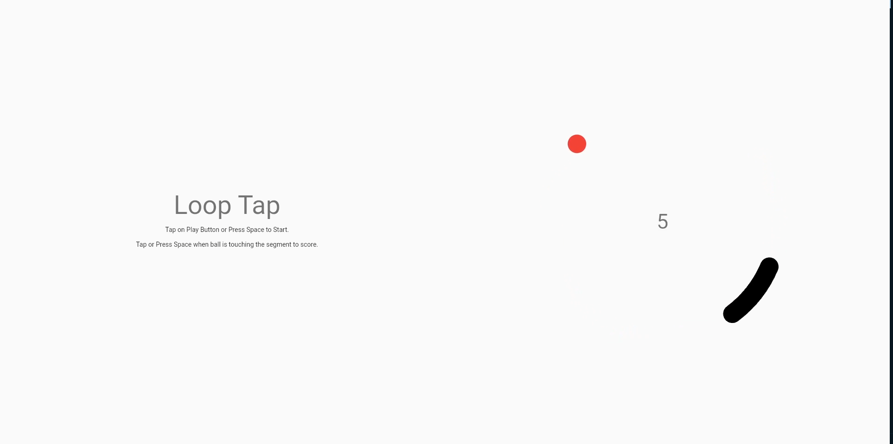

# Loop Tap Game Tutorial

[Watch Tutorial](https://youtu.be/DFBs8oe-fJM)

A Hypercasual Game in Flutter.
The inspiration came from the ridiculously addictive time waster game coogyloop and a recent addition looptap. 
The basic idea of the game is you only need to tap when the ball is inside the colored area in  on the loop to score the point.

## Getting Started With Flutter

This project is a starting point for a Flutter application.

A few resources to get you started if this is your first Flutter project:

- [Lab: Write your first Flutter app](https://flutter.dev/docs/get-started/codelab)
- [Cookbook: Useful Flutter samples](https://flutter.dev/docs/cookbook)

For help getting started with Flutter, view our
[online documentation](https://flutter.dev/docs), which offers tutorials,
samples, guidance on mobile development, and a full API reference.
